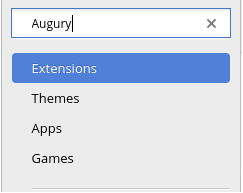
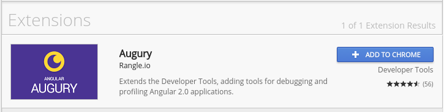
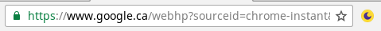

# Welcome to Augury

[todo] LOGO HERE

Augury is a Angular application inspection tools that runs in the Web browser. Augury runs alongside the Developer Tools (DevTools). 

Augury helps with gaining a better understanding of how an Angular application structure and the relationship between the following.

* Components
* Services
* Routes
* Modules
* Dependencies
* Injectors

It also compliments DevTools during a debugging session, making it easy to modify states and emit events.

## Installing Augury

The best way to install Augury is to head over to [chrome web store](https://chrome.google.com/webstore/category/extensions?hl=en). Once there, select _Extensions_ from the side panel and type "Augury" into the search field, then press _Enter_.

The Augury extension similar to the following from _rangle.io_ should be visible.

Click on "Add To Chrome", a _popup_ will open, select "Add extension" to complete the process. Once the _plugin_ has been added successfully installed, an Augury icon will appear next to the address bar in the browser.

The Augury icon provides additional information when clicked. Click on the icon now to discover what that is.

## Using Augury

To start using Augury, it is important that you have an Angular application running in the browser to be inspected. This _Guide_ provides sample Angular application to use as well as addtional sections walking through the process of using Augury with these demo applications.

If you have never debugged a JavaScript application, you may not be aware that each modern Web browser provides a debug environment from the browser. It can be opens use the following _shortcut_.

* On Linux use `Ctrl + Shift + I`
* On Mac use `Cmd + Opt + I on Mac`
* On Windows use `Ctrl + Shift + I`

When the DevTools is opened, you will find Augury tab on the far right.

