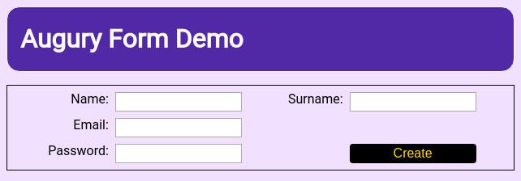
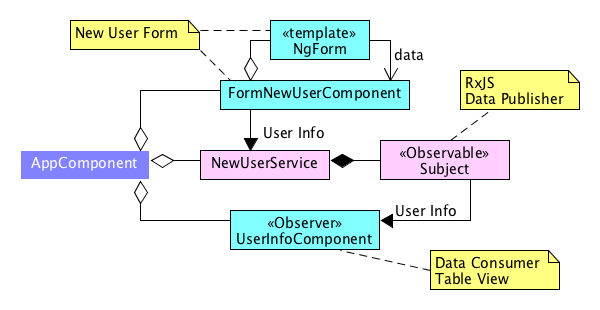
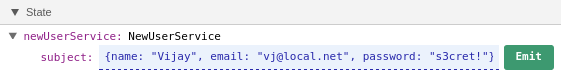
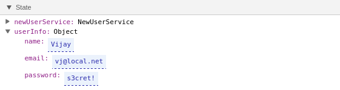
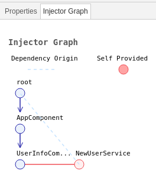

# Angular Form : New User


## Description

The _New User Form_ application exemplifies using a simple Angular _template_ based _Form_ that uses a data _service_ to hold the submitted value. The data service provides an _Observable_ stream to monitor updates. A table _component_ subscribes to the data service and displays the most recently submitted user info.

The _New User Form_ application is composed of 3 _components_ and 1 _service_.

## Components

1. AppComponent
1. FormNewUserComponent
1. UserInfoComponet

## Service

* NewUserService

## Architecture

The Angular application makes use of _RxJS_ to create a data _stream_ to publish the _user info_. When the _Create_ button is clicked on, the user data is sent to the _service_ using a API call. The _service_ then publishes the data using the _RxJS Subject_.



The HTML Form is provided by the `FormNewUserComponent` component. The table view of the user info is presented by the `UserInfoComponent`, it simply subscribes to the _Subject_ publishing the user info data.

## Opening Augury
To use Augury, we must open DevTools first with the following keyboard shortcut.

```
Ctrl + Shift + I (Cmd + Opt + I on Mac)
```

When DevTools opens, select the **Augury** tab, located on the far right. In DevTools, under the _Component Tree_ tab, you will see the following parent and children tree relationship for Angular _components_ and the HTML DOM _elements_.


The default view setting, called the _Hybrid view_, can be changed from the settings.


## Component View

Augury shows that the _New User Form_ Angular application has 3 components. The _Root_ component is called `AppComponent` which in turn contains 2 children components, `UserInfoComponent` and `FormNewUserComponent`.

Select `AppComponent` from the _Component Tree_, on the right side in the _Properties_ tab, we see the single property `title` under State. Augury allows the value of property `title` to be modified. This is indicated by displaying a edit field with a dashed blue line on the bottom.


## Dependency
Let's take a look at the `UserInfoComponent`, select it in Augury from the Component Tree. From the Properties tab, we see under state, the component has one _active_ property `newUserService` and the component has one dependency `NewUserService`.


If we take a look at the source code, the class for the component actually has 2 members (properties), `userInfo` and `newUserService`.

```js
export class UserInfoComponent {

  userInfo;

  constructor( private newUserService: NewUserService ) {
    this.newUserService.getStream().subscribe(
      data => this.userInfo = data
    );
  }

}
```

Since `userInfo` is not assigned a value, it contains the value of `undefined`, which is a Javascript rule. As a result, we don't see this property in the _Properties_ tab. Actually all properties not assigned a value will be removed by TypeScript during the compile stage. Likewise `newUserService` is assigned a value (reference to service) by the Injector using Angular's Dependency Injection (DI).

Let's _publish_ a hand crafted user info using Augury in debug mode. In the _Properties_ tab, under _State_ expand property `newUserService` as shown below so the _Emit_ button is visible.

Type in a Javascript object with the fields, _name_, _email_ and _password_ containing some value.



When this data has been emitted, you will see this data displayed by the `UserInfoComponent` in a table view.


In the _Properties_ tab, the State should now look like this.



Since the `surname` field was left out from the emitted user info data, it shows up empty in the table view on the webpage. Likewise it's missing from the _State_ under the _Properties_ tab in Augury for object `userInfo`.

## Injector Graph

Besides looking at the source code to determine dependencies, Augury provides a visual way to see this through the _Injector Graph_ tab located next to the _Properties_ tab. If we open it, we'll see the following.



First you need to know how the _Injector_ graph generates the graph, it does not show the graph for the entire application. What is shown is the dependency of the selected _component_ up its ancestry chain to the _Root injector_.

Further reading of the [Injector Depdency Tree](https://angular.io/docs/ts/latest/guide/hierarchical-dependency-injection.html) can be found in the Angular guide.

### Understanding The Graph

Let's look at how to read the _Injector_ graph. At the top we have the _Root injector_, conceptually this is what will be found in application `NgModule`, the root module. 

In the code, looking at file `app.module.ts` we see 3 _components_ being declared by the root module as well as the one _service_ `NewUserService` that is registered with the _Root injector_.

```js
@NgModule({
  declarations: [
    AppComponent,
    FormNewUserComponent,
    UserInfoComponent
  ],
  imports: [
    BrowserModule,
    FormsModule,
    HttpModule
  ],
  providers: [NewUserService ],
  bootstrap: [AppComponent]
})
export class AppModule { }
```

Looking at the graph, we see that `UserInfoComponent` is projected by the `AppComponent`, it's parent _component_. This is obvious if we look at the code (`app.component.ts`), in the _template_ string we can see `<app-user-info>` being used.

```js
@Component({
  selector: 'app-root',
  template: `
...
    <div class="pt3">
      <app-user-info></app-user-info>
    </div>
...
`
})
export class AppComponent {
  title = 'Angular Form: New User';
}
```

Looking next at `UserInfoComponent`, we see a red line extending to the right, connecting to a circle labled `NewUserService`. This denotes that the `NewUserService` _service_ is being inject into _component_ `UserInfoComponent`. 

The dashed blue line from the _Root injector_ to `NewUserService` indicates this _service_ is provided by the _Root injector_. This identifies the _service_ as being a _singleton_ (global shared instance), that's available throughout the entire application.

Pay close attentions to the colours of the _components_ and _service_. The circle is hollow for _service_, this means the _service_ is not provided by the _component_, it's being provided from an ancestor in the dependency tree.

### Service Registered At The Parent

Let's play around with _service_ registration. Instead of the _service_ being provided by the _Root_ injector, we're going to override this behaviour. Let's have `AppComponent` register the _service_ being used by `UnderInfoComponent`. If we open of the file `app.component.ts` and add a _providers_ array and _import_ like this:

```js
import { NewUserService  } from './new-user.service';

@Component({
  providers: [NewUserService ],
  selector: 'app-root',
```

The _Injector_ graph now look like this.


The only thing that's changes in the dashed blue line, coming from `AppComponent` to the _service_. This as we should know it now, indicates `NewUserService` is coming from the parent _injector_ of `AppComponent`.


Along the top under _Component Hirearchy_ we see that the selected `UserInfoComponent` component is a child of `AppComponent`. Lower down under _Injector Graph_, we 


A _service_ can also be injected at the _component_ level, to see how this would look from the injector grap we can make a simple code alteration for class `UserInfoComponent` in the file `user-info.component.ts`.

In the `@Component` decorator, include the `providers` array like this:

```js
@Component({
  providers: [NewUserService ],
  selector: 'app-user-info',
  template: `
  ...
})
```

If we now look at the _Injector Graph_, we'll see the dashed line as disappeared. 


The `NewUserService` is being injected into `UserInfoComponent` as well as being registered with `UserInfoComponent`.

**Note**: This change will break the code as the application no longer uses the same `singleton` _service_ to communicate data. This was for demonstration purpose only of the _Injector Graph_.

---
### The Augury Team!

[Copyright notice etc.]
