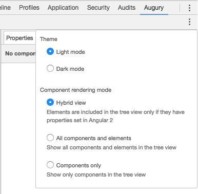
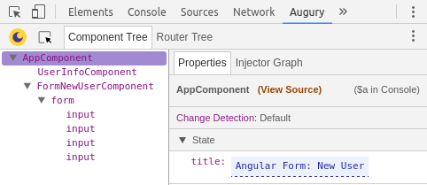
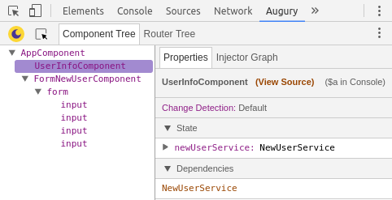

# Angular Form : New User


## Description

The _New User Form_ application exemplifies using a simple Angular _Template_ based _Form_ that uses a data service to hold the submitted value. The data service provides an Observable stream to monitor updates. A table component subscribes to the data service and displays the most recently submitted user info.

The _New User Form_ application is composed of 3 _components_ and 1 _service_.

## Components

1. AppComponent
1. FormNewUserComponent
1. UserInfoComponet

## Service

* NewUserService

## Architecture

The Angular application makes use of _RxJS_ to create a data stream to publish the _User info_. When the _Create_ button is clicked on, the user data is sent to the service using a API call. The service then publishes the data using the _RxJS Subject_.


The HTML Form is provided by the `FormNewUserComponent` component. The table view of the user info is presented by the `UserInfoComponent`, it simply subscribes to the _Subject_ publishing the user info data.

## Opening Augury
To use Augury, we need to open DevTools.

```
Ctrl + Shift + I (Cmd + Opt + I on Mac)
```

When DevTools is opened, select the **Augury** tab, located on the far right. In DevTools, under the _Component Tree_ tab, you will see the following parent and children tree relationship for Angular components and the HTML DOM elements.


This is the default view setting, which is called the _Hybrid view_. This view setting can be changed from the settings [todo]: need ui name?.



## Component View

Augury shows that the _New User Form_ Angular application has 3 components. The _Root_ component is called `AppComponent` which in turn contains 2 children components, `UserInfoComponent` and `FormNewUserComponent`.

Select `AppComponent` from the _Component Tree_, on the right side in the _Properties_ tab, we see the single property `title` under State. Augury allow the value of `title` to be modified.



## Dependency
Let's take a look at the `UserInfoComponent`, select it in Augury from the Component Tree. From the Properties tab, we see under state, the component has one _active_ property `newUserService` and the component has one dependency `NewUserService`.



Looking at the source code, the class for the component actually has 2 members (properties), `userInfo` and `newUserService`.

```js
export class UserInfoComponent {

  userInfo;

  constructor( private newUserService: NewUserService ) {
    this.newUserService.getStream().subscribe(
      data => this.userInfo = data
    );
  }

}
```

Since `userInfo` by default is not assigned a value, it contains the value of `undefined`, which is a Javascript rule. As a result we don't see this (passive) property in Augury's Properties tab. Actually all properties not assigned a value will be removed by TypeScript during the compile stage. Likewise `newUserService` is an (active) property, it's assigned a value by the Injector using Angular's Dependency Injection (DI).

Let's publish a hand crafted user info using Augury in debug mode. In the Properties tab, under State expand property `newUserService` as shown below so the _Emit_ button is visible.


When this data has been emitted, you will see the data displayed by the `UserInfoComponent` in a table view.


In the _Properties_ tab, the update State should now look like this.


Since the `surname` field in was let out from the emitted user info data, it shows up blank in the table view in the webpage. Likewise it's missing from the _State_ under the _Properties_ tab in Augury.

## Injector Graph

Besides looking at the source code to determine dependencies, Augury provide a visual way to see this through the _Injector Graph_ tab located next to the _Properties_ tab. If we open it, we'll see the following.


[todo] !!! This needs to be written once the new injector graph is in master !!!

Along the top under _Component Hirearchy_ we see that the selected `UserInfoComponent` component is a child of `AppComponent`. Lower down under _Injector Graph_, we 

---
### The Augury Team!

[Copyright notice etc.]
