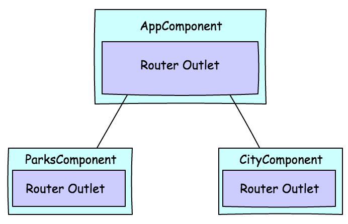
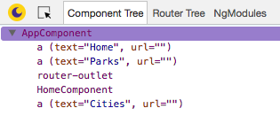

## Description

The _Routes_ Angular application demonstrates the uses of routes as well as lazy loaded child routes. The application also makes use of multiple router outlets.

The application contains 10 components and 2 modules. The _root_ module `app.module.ts` contains the following components:

* AppComponent
* HomeComponent
* ParksComponent
* ParkOneComponent
* ParkTwoComponent
* ParkThreeComponent

The _city_ module `city.module.ts` contains:

* CityComponent
* CityOneComponent
* CityTwoComponent
* CityThreeComponent

## Architecture

The component code is simple, the `AppComponent` has a single router outlet. When the `ParksComponent` or `CityComponent` component is loaded, a second router outlet will be provided. Components from the child route will get loaded into the second router outlet.



The application root module `app.module.ts` provides routes for _root_ and _parks_, which are:

```
/
/home
/parks
/parks/park1
/parks/park2
/parks/park3
```

The root path `/` gets redirect to `/home`. Also the lazy loaded route for `cities` is defined here.

The city module `city.module.ts` contains the routes for _cities_ below:

```
/cities/city1
/cities/city2
/cities/city3
```

## Opening Augury

To use Augury, we need to open DevTools.

```
Ctrl + Shift + I (Cmd + Opt + I on Mac)
```

When DevTools is open, we select the _Augury_ tab, located on the far right.

## Router outlet

Once Augury is open, select `AppComponent` in _Component Tree_ then select the _Injector Graph_ tab. Both views shows `router-outlet` in _Component Tree_ as a child of `AppComponent`.



In the application, click on the _Parks_ button, this will load the `ParksComponent` and update _Component Tree_ view. You will notice a second `router-outlet` that appears under `ParksComponent`, this is were each of the park component will load into. Try clicking each of the links labeled:

* Park 1
* Path 2
* Park 3

Notice how each child Park component is loaded under `ParksComponent` just underneath `router-outlet`. This is how Angular inserts a component into the `router-outlet` in the DOM, as a sibliing element.

From the _Component Tree_ select


